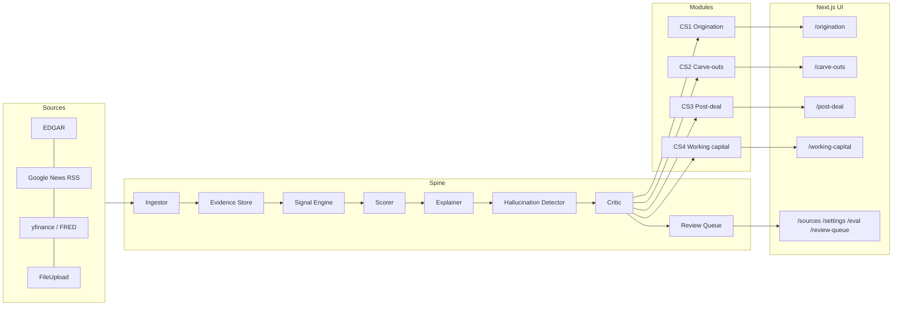

# Architecture

One-page view of the platform. Four modules, one spine.

## Diagram



## Layers

1. **Sources** — pluggable `Source` adapters behind a uniform interface.
   Each adapter yields `Evidence` records.
2. **Spine** — orchestrates ingest → evidence → signals → score → explain
   → critic. All stateful operations persist to Postgres.
3. **Modules** — thin per-case configuration on top of the spine:
   module-specific signals, weights, output shape and UI views.
4. **UI** — single Next.js app with module routes plus four shared
   utility routes.

## Data flow invariants

- No claim is surfaced to UI without at least one `Evidence` referenced
  by its `explanation.evidence_ids`. Enforced by
  `backend/app/explain/unsupported_claims.py` on every response.
- Every explanation is measured for hallucination post-generation: sentence
  coverage against evidence (cosine similarity + fact matching), unsupported
  claim count logged in `LLMCall.hallucination_score` and
  `LLMCall.evidence_coverage_pct`. Surfaced via `/eval/llm` dashboard.
- CS1 and CS2 pipelines execute only against `public_*` sources. The
  segregation test (`backend/tests/test_segregation.py`) walks imports
  and fails CI on a cross-boundary import.
- The `Critic` re-runs the score+explain chain up to 2 times if its
  rubric score is below `CRITIC_PASS_THRESHOLD` (default 0.7). Output
  after max retries is still surfaced but flagged `needs_review`.

## Resilience

- Jobs are idempotent by `(source_id, external_id)` upsert key.
- Scheduler state lives in Postgres (APScheduler Postgres job store), so
  weekly restarts resume cleanly.
- The LLM client retries with exponential backoff on 429/5xx and falls
  back to deterministic fixture output when offline.

## Boundary diagram

```
public-data modules  ──▶ sources/public/*      ──▶ Evidence (scope=public)
uploaded-data modules ──▶ sources/upload/*     ──▶ Evidence (scope=client)
                          sources/public/*     ──▶ Evidence (scope=public)  (benchmarks only)
```

The `Evidence.scope` column is checked at read time: a request in a
public-only module cannot read `scope=client` rows.
